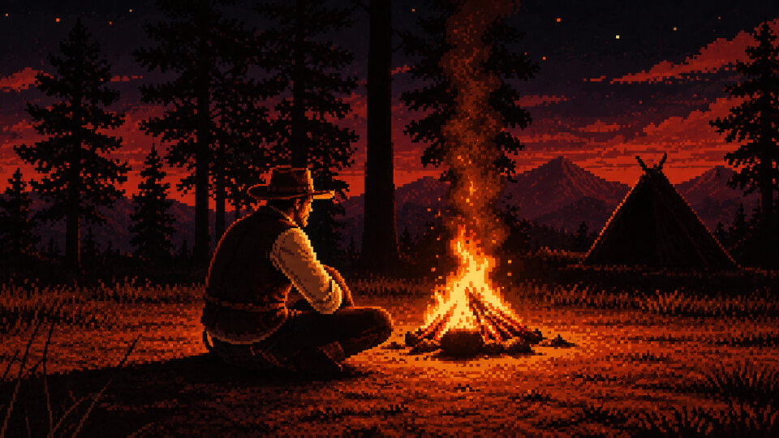

# RDR2 Crafting Guide

What to craft in Red Dead Redemption 2, what it needs, and what you already have.

**Open it: <https://arindambose.com/rdr2-crafting-guide/>**

Free, with no ads and no sign-up. It works offline, and you can install it on
your phone like an app.

## About

A companion for crafting in Red Dead Redemption 2's story mode. It covers
every recipe Pearson, the Trapper and the Fence will make for you, and every
one you can cook at your own campfire, with what each takes and where to find
it.

The game leaves you to remember which pelt goes to whom. The guide keeps that
list for you: log what you carry, and it works out what you can craft right
now and what you are still short of.

- **180 materials**: pelts, animal parts, plants and supplies. Each shows the
  animal it comes from, the weapon that keeps the pelt perfect (or, for a fish,
  the bait) and which vendors still want it.
- **255 recipes**: 165 one-time crafts at Pearson, the Trapper and the Fence,
  and 90 campfire recipes you can make as often as you like.
- **Two modes**: *General* is the plain reference. *Personalize* counts what
  you hold against what each vendor wants, and moves anything crafted or
  skipped out of the way.
- **Works offline** once it has loaded, and installs to your home screen.
- **Two looks**: parchment or leather, set in Settings.

### Your data stays with you

There is no account and no server behind the guide. The recipes ship with the
page, and everything you log stays in your browser: nothing you enter is ever
uploaded. The one thing that goes out is a visit count: Google Analytics sees
which pages are opened, never what you log.

The flip side is that your data lives only in that browser. Use **Back up** now
and then, and keep the file somewhere safe.

## How to use it

1. **Pick a mode.** The switch at the top of every page flips between
   *General* and *Personalize*. Use General to look things up. Turn on
   Personalize to keep track of what you have; logging only works there.
2. **Find what you need.** **Materials** lists everything there is to collect,
   with the recipes each one goes into and the vendors who still want it.
   Filter by vendor or category, or search by name or animal. Open a card for
   where it comes from and how to bring it in perfect.
3. **Log what you gather.** Either:
   - in a material's card, tap **+ Add** or **-** to log one at a time,
     straight away; or
   - on **Inventory**, pick the Satchel, Pearson or the Trapper, step the
     counts up or down, then **Save** them as one batch. **Transfer to** on a
     row hands items from your Satchel to Pearson or the Trapper, and back.

   Every change offers **Undo** for a few seconds.
4. **Craft.** On **Recipes**, *Ready to craft* shows what you can make now.
   Open a recipe and press **Craft**: its ingredients come out of that vendor's
   stock (the Fence draws on your Satchel), and it is marked crafted. **Skip**
   sets aside a recipe you do not want, and **Put back** undoes a craft. The
   **Campfire** recipes are there to look up; they are never ticked off.
5. **Keep a backup.** **Back up** at the top saves everything to one file, and
   a dot on it says when one is due. To restore, use **Bring it back** in
   Settings.

**Install it:** open **Settings → On your home screen**. Where your browser
allows it, that tile has an **Install** button; elsewhere it gives your
browser's own steps.

## Run it yourself

It is a static site with no build step. From the repository root:

    python3 -m http.server 8000

then open <http://localhost:8000>. It has to be served over HTTP, not opened as
a file.

The [extended README](EXTENDED_README.md) covers the rest: the privacy policy
in detail, how the database and the search pages are built, hosting, the
design, and every screen.

## Credits

The reference data was gathered from community guides and wikis:
[IGN](https://www.ign.com/wikis/red-dead-redemption-2),
[RDR2 Map](https://rdr2map.com/),
[Red Dead Wiki](https://reddead.fandom.com/wiki/Red_Dead_Redemption_2),
[RankedBoost](https://rankedboost.com/red-dead-redemption-2/wiki-guides/),
[RDR2.org](https://www.rdr2.org/wiki/),
the [Red Dead Redemption II Crafting Personalized](https://www.notion.com/templates/red-dead-redemption-ii-crafting-personalized)
Notion template, and Reddit posts by
[u/JimmyJames86](https://www.reddit.com/r/reddeadredemption/comments/kunnbu/rdr2_hunting_and_crafting_guide_story_mode/),
[u/BazaarOnion](https://www.reddit.com/r/RDR2/comments/9u9zjq/all_required_resource_checklist_for_story_mode/)
and [u/kingkashue](https://www.reddit.com/r/reddeadredemption/comments/s8wlx3/rdr2_crafting_spreadsheet_updates_your_total/).

Fonts: Marston by Neale Davidson ([Pixel Sagas](https://www.pixelsagas.com)),
RDR Lino Regular ([Web Fonts](http://www.onlinewebfonts.com), CC BY 4.0) and
FB Remington ([DaFont](https://www.dafont.com/fb_remington.font)).

Made with love by [Arindam Bose](https://arindambose.com/), powered by
[Claude](https://claude.ai). If the guide saved you a ride back to Valentine,
you can [buy me a coffee](https://buymeacoffee.com/arindambose).

A fan-made tool, not affiliated with or endorsed by Rockstar Games or
Take-Two Interactive.
